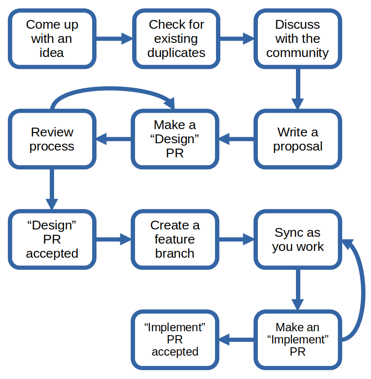

# Advanced Contribution

The contributions described below are advanced because they use complex workflows or require more experience.
If you like the challenge, this is the place for you.

By now you should have worked through the [previous parts](README.md) of the project contributing guide, and also [made at least one contribution](who-written-for.md).

## About the Advanced Contribution Process

This is a large project which gets many design proposals.
Design proposal discussions can take a long time.

Making a PR with a design proposal simplifies this process:

* Each design proposal has its own line of comments
* Replies around each line are easy to track
* As proposals change, pages reset as their line items resolve
* GitHub maintains the entire history

## Refactor or Cleanup Proposal

A refactor or cleanup proposal changes Docker's internal structure without altering the external behavior. To make this type of proposal:

1. Fork `moby/moby`.

2. Create a feature-branch and make your changes in it.

3. Sync and rebase with `master`.

4. Run the full test suite.

5. Submit a pull request (PR):

    PR's title's format:

    **area/of/code: _short title_**

    If the area of code section is further down the code base than `area/of/code`, use **_Short Title_** instead.

    If the changes require a change in logic, note that in the PR.

6. Finish the review process until merge.

## Design Proposal

Design proposals solve a problem or add a feature.
The process for submitting design proposals requires two pull requests:

 - one for the design
 - one for the implementation

Here's an example diagram of the design proposal process:

Notice that both the design PR and the implementation PR go through review.
You might want to pair with someone on design work.

### Design Proposal in Detail

1. Come up with an idea:

    Ideas usually come from limitations users feel working with a product. So,
    take some time to really use Docker. Try it on different platforms; explore
    how it works with different web applications. Go to some community events
    and find out what other users want.

2. Check for existing duplicates:

    Review existing issues and proposals and make sure no other similar idea has been proposed.
    Issues can be found at [our GitHub Issues page](https://github.com/moby/moby/issues).
    Design proposals can be found at [our GitHub Pull requests page](https://github.com/moby/moby/pulls).

3. Discuss with the community:

    Check out our [community page](https://mobyproject.org/community/), where you'll find links to our [Twitter account](https://twitter.com/moby), [Slack channel](https://dockr.ly/comm-slack) and [forum](https://forums.mobyproject.org/).
    Reach out, share and discuss your idea with other community members.

4. Write a proposal:

    - Fork `moby/moby`
    - Clone the repo to your localhost
    - Create a new Markdown file in the area you wish to change:

        For example, if you want to redesign our daemon, create the new file in the `daemon` folder.

    - Give the new file a descriptive name, for example  `redesign-daemon-proposal.md`:

        This Markdown file describes your idea.

        Your proposal should include information like:

        * Why is this change needed?
        * what are the use cases?
        * What are the requirements this change should meet?
        * What are some ways to design / implement this feature?
        * Which design / implementation do you think is best and why?
        * What are the risks or limitations of your proposal?

5. Make a "Design" PR:

    Submits your proposal in a PR to `moby/moby`.

    The PR title should have the format:

    **area/of/code: _short title_**

    If the area of code section is further down the code base than `area/of/code`, use **_Short Title_** instead.

    The body of the PR should include a brief summary of your change and point to the Markdown file you created (for example, "_See `daemon/redesign-daemon-proposal.md` for a complete description_").

6. Review process:

    The maintainers and the community will review your proposal. Answer their questions, and if needed, explain your approach.

7. "Design" PR accepted:

    Note that your PR may also be rejected.
    You had a great idea, but unfortunately not every idea makes it in.
    For now, let's assume it was accepted.

8. Create a feature-branch:

    Implement your idea, using all the standard practices of any project contribution.

    * fork `moby/moby`
    * create a feature-branch

9. Sync as you work:

    * sync frequently back to master
    * test and sync as you work
    * run full test suite before the "Implementation" PR

    For any issues, the community is always there to help.

10. Make an "Implement" PR:

    When you have a complete implementation of the change, submit a PR back to `moby/moby`.

    Go through review process and iterate on your code.

11. "Implement" PR accepted:

    And, also, merged.
